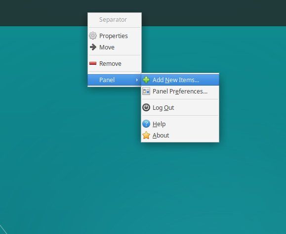
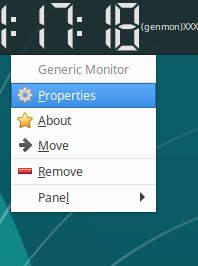
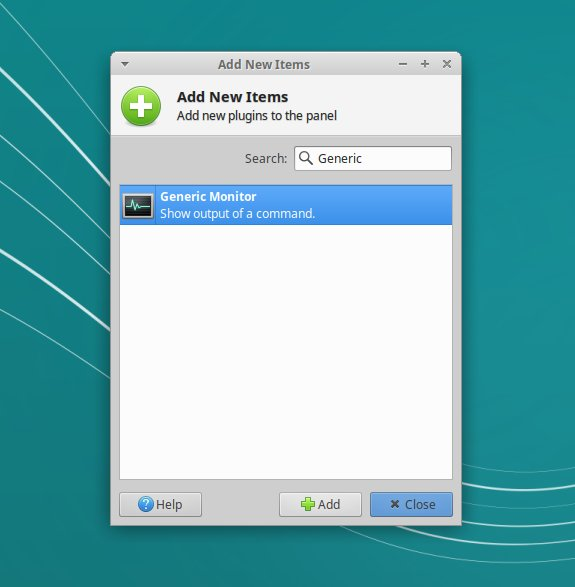
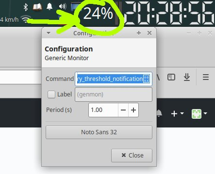

# xemper
An script for properly seeing memory usage percentage using Xfce4 Generic Monitor in xfce panel.

This script is intended to be used in xfce desktop environment. For example if you are using Xubuntu you can enjoy it.

Install Generic Monitor for xfce4:

apt install xfce4-genmon-plugin

Then:
cd ~
git clone https://github.com/eranik/xemper

Now do as follow step-by-step:

1. Right-click on xfce panel and press add new item:

2. Search for Generic Monitor:

3. Right click on the Generic Monitor Plugin item added to your xfce panel and click properties:

4. In the properties provide the path to "memory_threshold_notification" script of this repository, also set the font size to 32 for readability: 

